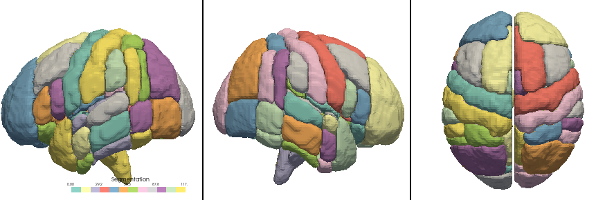

# ATLASpy: A python library for visualizing volumetric brain data

## Installation

To install:

```
pip install atlaspy
```

You should be able to use atlaspy after that.

## Examples

Detailed examples of using ATLASpy can be found here: https://github.com/allucas/atlaspy/blob/main/examples/atlaspy_examples_v2.ipynb

ATLASpy is not restricted to the default atlases included, but it can use any atlas as long as STL files are available for it. See here for instructions on how to generate these STL files: https://github.com/allucas/atlaspy/tree/main/examples/custom_atlas_readme.md

### Plotting the DKT Atlas

```
import atlaspy.core as apy
apy.plot_raw_atlas_lrt('dkt', cmap='Set3')
```

This will plot the DKT atlas with random coloring for each ROI 


We can repeat this process for the HarvardOxford atlas using `ho`:
```
apy.plot_rois_atlas_lrt('ho', df_values, cmap='Set3')
```


The Schaefer400 atlas using `sch400`:
```
apy.plot_rois_atlas_lrt('sch400', df_values, cmap='Set3')
```


### Plotting the DKT Atlas with custom values

For plotting values from a CSV file or a dataframe, the columns of the CSV must include `atlas_index`, which is the number assigned to the ROI of each atlas, and `roi_value`, which is the values that we would like to plot at that brain region. The atlases used are included in `source_data/atlases/niftis` and their region assignments in `source_data/atlases/luts`. An example input CSV is included in `examples/cortical_thickness_dkt.csv`. To visualize this example use the code below:

```
import atlaspy.core as apy
import pandas as pd
df_values = pd.read_csv('examples/cortical_thickness_dkt.csv')
apy.plot_rois_atlas_lrt('dkt', df_values, cmap='Set3')
```

This will generate something like this:


We can change the colormap to any [Matplotlib colormap](https://matplotlib.org/stable/tutorials/colors/colormaps.html)

```
apy.plot_rois_atlas_lrt('dkt', df_values, cmap='RdYlBu')
```
This will generate something like this:


